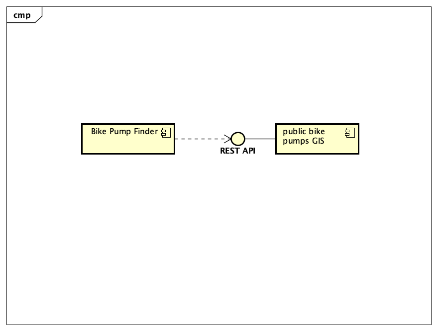

# Implementation

## Introduction
TODO: Describe the system implemented (Describe the dataset. Are there any known issues? Describe any configuration data).

## Project Structure
TODO: Provide an outline of the project folder structure and the role of each file within it.
provide a table listing the number of jslint warnings/reports for each module.
```
└── 📁ParkHub-Group-Project
    └── 📁__MACOSX
        └── 📁documentation templates
            └── 📁docs
                └── 📁images
                    ├── ._.DS_Store
                    ├── ._class1.png
                    ├── ._component.png
                    ├── ._component.png.bak
                    ├── ._context.png
                    ├── ._deployment.png
                    ├── ._deployment.png.bak
                    ├── ._mockup.png
                    ├── ._screenshot.png
                    ├── ._sequence.png
                    ├── ._use-case.png
                    ├── ._wireframe.png
                ├── ._.DS_Store
                ├── ._contribution.md
                ├── ._design.md
                ├── ._images
                ├── ._implementation.md
                ├── ._planning.md
                ├── ._requirements.md
                ├── ._testing.md
            ├── ._.DS_Store
            ├── ._docs
            ├── ._readme.md
        ├── ._documentation templates
    └── 📁Code
        └── 📁images
            ├── 3linesHorrizontal.png
            ├── 3linesVertical.png
            ├── dropdownTriangle.png
            ├── mainMenuActive.png
            ├── mainMenuPassive.png
            ├── marker_blue.png
            ├── marker_orange.png
            ├── marker_shadow.png
        ├── explore.html
        ├── feedback.html
        ├── filter.php
        ├── home.html
        ├── instructionsForNextView.txt
        ├── mainPageStyling.css
        ├── menuStyling.css
        ├── plan.html
        ├── scripts.js
        ├── useableCode.txt
    └── 📁Documentation Files
        └── 📁Documentation
            └── 📁images
                ├── .DS_Store
                ├── class1.png
                ├── component.png
                ├── component.png.bak
                ├── context.png
                ├── ContextDiagram.png
                ├── deployment.png
                ├── deployment.png.bak
                ├── Design.png
                ├── Diagram.png
                ├── mockup.png
                ├── screenshot.png
                ├── sequence.png
                ├── use-case-diagram.png
                ├── Use-case-disgram-2.png
                ├── webside-Design.png
                ├── Website-Details.png
                ├── wireframe.png
            ├── .DS_Store
            ├── contribution.md
            ├── design.md
            ├── implementation.md
            ├── planning.md
            ├── requirements.md
            ├── testing.md
        ├── .DS_Store
        ├── readme.md
    ├── .gitattributes
    └── README.md
## Software Architecture
TODO: Describe the major components of your architecture. Are any particular architectural styles being used?



## Bristol Open Data API
TODO: Document each query to Bristol Open Data


TODO: Repeat as necessary

# User guide
TODO: Explain how each use-case works by providing step-by-step screenshots for each use-case. This should be based on a tested scenario.
